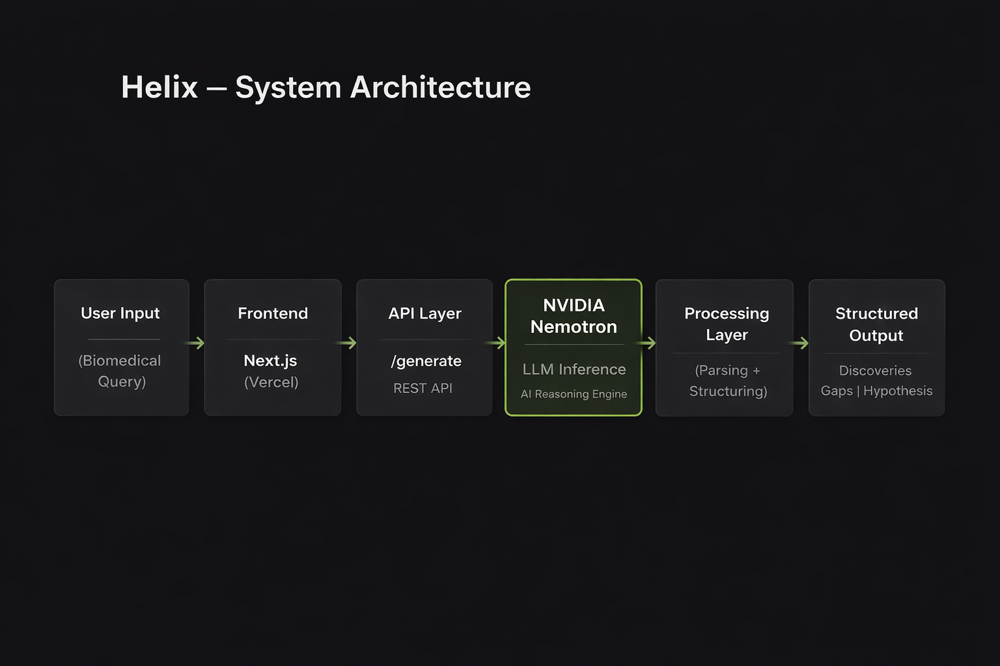

# Helix: AI for Biomedical Discovery (NVIDIA Nemotron)

## 🚀 Overview
Helix is an AI-powered system that generates structured biomedical research insights using NVIDIA Nemotron.

It produces:
- Known discoveries  
- Research gaps  
- Novel hypotheses  

from natural language prompts.

---

## 🧠 System Architecture



---

## ⚙️ Tech Stack
- NVIDIA Nemotron (LLM)
- Next.js (Frontend)
- API Routes (/generate)
- Vercel (Deployment)

---

## 🧪 Example Output

```json
{
  "discoveries": "Known findings in the domain...",
  "gaps": "Unexplored areas...",
  "hypothesis": "Potential new direction..."
}
